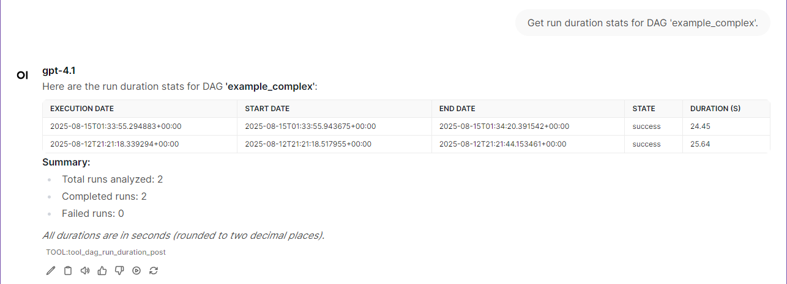
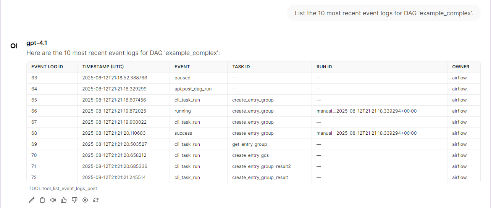
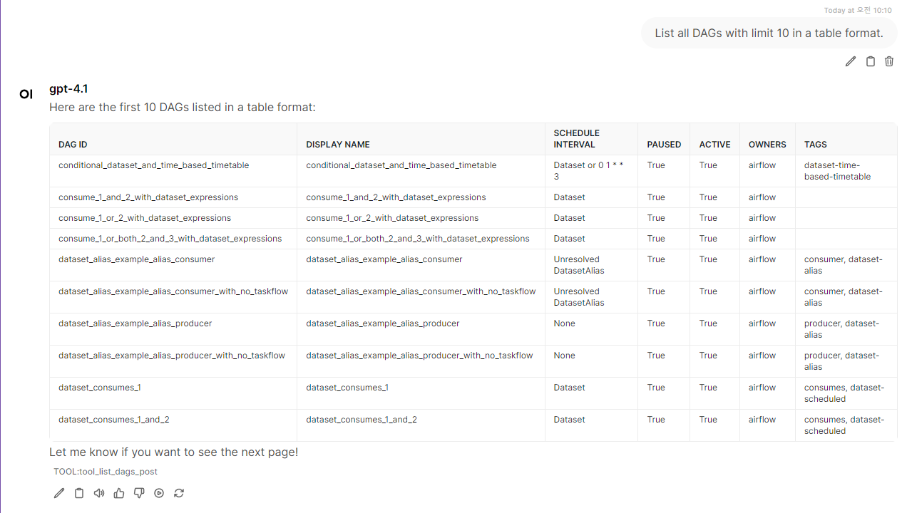

# MCP-Airflow-API

**Apache Airflow MCP Server** | **Model Context Protocol** | **Natural Language DAG Management** | **Airflow API Integration**

> **Benefits**: Monitor and manage Apache Airflow clusters through natural language queries via MCP tools: DAG inspection, task monitoring, health checks, and cluster analytics without API complexity.

[](https://mseep.ai/app/d024d598-d442-4e4e-827b-d976e4d372fb)

[](https://github.com/call518/MCP-Airflow-API/actions/workflows/pypi-publish.yml)

## Overview

**MCP-Airflow-API** is a Model Context Protocol (MCP) server that transforms Apache Airflow REST API operations into natural language tools for LLM integration. Built for DevOps engineers, data engineers, and Airflow administrators who need intuitive cluster management capabilities.

### Key Features
- 🔍 **Natural Language Queries**: Query Airflow DAGs, tasks, and runs using plain English
- 📊 **Comprehensive Monitoring**: Real-time cluster health, DAG status, and performance analytics  
- 🐳 **Docker Ready**: Streamable HTTP transport with Docker Compose orchestration
- 🔧 **43+ MCP Tools**: Complete Airflow API coverage including DAGs, tasks, pools, variables, connections, configuration, and XCom
- ⚡ **Enterprise Scale**: Optimized pagination for large Airflow environments (1000+ DAGs)
- 🛡️ **Production Safe**: Read-only operations by default to minimize operational risk

### Topics
`apache-airflow` `mcp` `model-context-protocol` `airflow-api` `dag-management` `data-engineering` `devops` `airflow-monitoring` `llm-integration` `natural-language` `docker` `python` `workflow-automation` `airflow-tools` `data-pipelines`

**Note:** This MCP server includes both read-only operations and essential DAG management functions (trigger, pause, unpause) for comprehensive Airflow cluster control. Write operations like connection management are implemented with appropriate safety measures.

---

Tested and supported Airflow version: 2.10.2 (API Version: v1) and WSL(networkingMode = bridged)

- [Airflow API Documents](https://airflow.apache.org/docs/apache-airflow/2.0.0/stable-rest-api-ref.html)

## Example Query - List DAGs


## Usages

This MCP server supports two connection modes: **stdio** (traditional) and **streamable-http** (Docker-based). The transport mode is automatically determined by the `FASTMCP_PORT` environment variable.

### Method 1: Local MCP (transport="stdio")

```json
{
  "mcpServers": {
    "airflow-api": {
      "command": "uvx",
      "args": ["--python", "3.11", "mcp-airflow-api"],
      "env": {
        "AIRFLOW_API_URL": "http://localhost:8080/api/v1",
        "AIRFLOW_API_USERNAME": "airflow",
        "AIRFLOW_API_PASSWORD": "airflow",
        "AIRFLOW_LOG_LEVEL": "INFO"
      }
    }
  }
}
```

### Method 2: Remote MCP (transport="streamable-http")

```json
{
  "mcpServers": {
    "airflow-api": {
      "type": "streamable-http",
      "url": "http://host.docker.internal:18002/mcp"
    }
  }
}
```

**Transport Selection Logic:**

- **stdio mode**: When `FASTMCP_PORT` environment variable is NOT set
- **streamable-http mode**: When `FASTMCP_PORT` environment variable is set

---

## QuickStart (Demo - streamable-http): Running OpenWebUI and MCP-Airflow-API with Docker

1. **Prepare an Airflow Demo cluster**  

- Try this: [Airflow-Docker-Compose](https://github.com/call518/Airflow-Docker-Compose)
- (Optional) See [Official Airflow Docker Install Guide](https://airflow.apache.org/docs/apache-airflow/stable/start/docker.html)

2. **Install Docker and Docker Compose**

- Ensure Docker Engine and Docker Compose are installed and running

### Setup and Configuration

3. **Clone and Configure**

- Clone Source codes

```bash
git clone <repository-url>
cd MCP-Airflow-API
```

- Create Python venv (two Options)

  - Option-1: with uv

  ```bash
  uv vene --python 3.11 --seed
  ```

  - Option-2: with pip

  ```bash
  python3.11 -m venv .venv
  source .venv/bin/activate
  pip install -U pip
  ```

4. **Ensure mcp-config.json**

- Check and edit `mcp-config.json.http`
- The file is pre-configured for streamable-http transport

5. **Ensure docker-compose.yml**

- Check Network Port numbers that you want.
- (NOTE) This Tested on WSL2(networkingMode = bridged)

6. **Start the Docker Services**

```bash
docker-compose up -d
```

### Service Access and Verification

7. **Check MCP Server REST-API (via MCPO Swagger)**

- Access: http://localhost:8002/docs
- Verify all Airflow API endpoints are available

8. **Access Open WebUI**

- URL: http://localhost:3002
- The interface includes integrated MCPO proxy support

9. Register the MCP server

- In [Settings] — [Tools], add the API address of the “airflow-api” tool (the link displayed in the MCPO Swagger), e.g., http://localhost:8001/airflow-api

10. Setup LLM

- In [Admin Pannel] - [Setting] - [Connection], configure API Key for OpenAI or Ollama.

11. Completed!

---

## Docker Configuration

The project includes a comprehensive Docker Compose setup with three separate services for optimal isolation and management:

### Services Architecture

1. **open-webui**: Web interface (port 3002)
   - Custom Open WebUI with integrated MCPO proxy support
   - Built from `Dockerfile.OpenWebUI-MCPO-Proxy`

2. **mcp-server**: MCP Airflow API server (port 18002→8080, internal 8080)
   - FastMCP-based MCP server with Airflow API tools
   - Built from `Dockerfile.MCP-Server` (Rocky Linux 9.3, Python 3.11)
   - Runs http transport when `FASTMCP_PORT` is set

3. **mcpo-proxy**: MCP-to-OpenAPI proxy (port 8002)
   - MCPO proxy for converting MCP tools to REST API endpoints
   - Built from `Dockerfile.MCPO-Proxy` (Rocky Linux 9.3, Python 3.11)
   - Provides Swagger documentation at `/docs`

### Configuration Files

The Docker setup uses these configuration files:

- `docker-compose.yml`: Multi-service orchestration
- `mcp-config.json.stdio`: MCPO proxy configuration for stdio transport
- `mcp-config.json.http`: MCPO proxy configuration for streamable-http transport
- `Dockerfile.MCPO-Proxy`: MCPO proxy container with Rocky Linux 9.3 base
- `Dockerfile.MCP-Server`: MCP server container with FastMCP runtime

### Environment Variables

The MCP server container uses these environment variables:

- `FASTMCP_PORT=8080`: Enables streamable-http transport mode
- `AIRFLOW_API_URL`: Your Airflow API endpoint
- `AIRFLOW_API_USERNAME`: Airflow username
- `AIRFLOW_API_PASSWORD`: Airflow password

### Service Access

- Open WebUI: http://localhost:3002
- MCP Server: http://localhost:18002
- MCPO Proxy: http://localhost:8002

### Container-to-Host Communication

The configuration uses `host.docker.internal:18002` for proper Docker networking when connecting from containers to host services.

## Features

- List all DAGs in the Airflow cluster
- Monitor running/failed DAG runs  
- Trigger DAG runs on demand
- Check cluster health and version information
- Minimal, LLM-friendly output for all tools
- Easy integration with MCP Inspector, OpenWebUI, Smithery, etc.
- **Enhanced for Large-Scale Environments**: Improved default limits and pagination support for enterprise Airflow deployments (100+ to 1000+ DAGs)

## Environment Variables Configuration

### Required Environment Variables

These environment variables are essential for connecting to your Airflow instance:

- `AIRFLOW_API_URL`: The base URL of your Airflow REST API endpoint
  - Example: `http://localhost:8080/api/v1`
  - Example: `https://airflow.company.com/api/v1`

- `AIRFLOW_API_USERNAME`: Username for Airflow API authentication
  - Example: `airflow`
  - Example: `admin`

- `AIRFLOW_API_PASSWORD`: Password for Airflow API authentication
  - Example: `airflow`
  - Example: `your-secure-password`

### Transport Control Variables

- `FASTMCP_TYPE`: Specifies the FastMCP transport type
  - Values: `http`, `stdio`
  - Default: Automatically determined based on `FASTMCP_PORT` setting
  - Example: `http` (for explicit HTTP transport)

- `FASTMCP_HOST`: Defines the host address for HTTP transport
  - Default: `0.0.0.0` (listens on all interfaces)
  - Example: `localhost` (local access only)
  - Example: `0.0.0.0` (accessible from all network interfaces)

- `FASTMCP_PORT`: Controls the transport mode selection
  - Default: `8080`
  - Example: `18002` (for Docker container internal port)

### Optional Configuration Variables

- `AIRFLOW_LOG_LEVEL`: Controls logging verbosity
  - Values: `DEBUG`, `INFO`, `WARNING`, `ERROR`
  - Default: `INFO`

### Configuration API Access

The Configuration Management tools require special Airflow settings:

- `AIRFLOW__WEBSERVER__EXPOSE_CONFIG`: Enable configuration API access
  - Values: `True`, `False`, `non-sensitive-only`
  - Default: `False` (Configuration API disabled)
  - **Required**: Set to `True` or `non-sensitive-only` to use Configuration Management tools

**Note**: This setting must be configured in your Airflow instance, not in the MCP server environment.

---

## Available MCP Tools

### DAG Management

- `list_dags(limit=20, offset=0, fetch_all=False, id_contains=None, name_contains=None)`  
  Returns all DAGs registered in the Airflow cluster with pagination support.  
  Output: `dag_id`, `dag_display_name`, `is_active`, `is_paused`, `owners`, `tags`, plus pagination info (`total_entries`, `limit`, `offset`, `has_more_pages`, `next_offset`, `pagination_info`)

  **Pagination Examples:**
  - First 20 DAGs: `list_dags()`
  - Next 20 DAGs: `list_dags(limit=20, offset=20)`
  - Large batch: `list_dags(limit=100, offset=0)`
  - All DAGs at once: `list_dags(limit=1000)`

  **Filtering Examples:**
  - `id_contains="etl"` → Only DAGs whose `dag_id` contains "etl"
  - `name_contains="daily"` → Only DAGs whose `display_name` contains "daily"
  - If both are specified, only DAGs matching both conditions are returned

- `running_dags`  
  Returns all currently running DAG runs.  
  Output: `dag_id`, `run_id`, `state`, `execution_date`, `start_date`, `end_date`

- `failed_dags`  
  Returns all recently failed DAG runs.  
  Output: `dag_id`, `run_id`, `state`, `execution_date`, `start_date`, `end_date`

- `trigger_dag(dag_id)`  
  Immediately triggers the specified DAG.  
  Output: `dag_id`, `run_id`, `state`, `execution_date`, `start_date`, `end_date`

- `pause_dag(dag_id)`  
  Pauses the specified DAG (prevents scheduling new runs).  
  Output: `dag_id`, `is_paused`

- `unpause_dag(dag_id)`  
  Unpauses the specified DAG (allows scheduling new runs).  
  Output: `dag_id`, `is_paused`

### Cluster Management & Health

- `get_health`  
  Get the health status of the Airflow webserver instance.  
  Output: `metadatabase`, `scheduler`, overall health `status`

- `get_version`  
  Get version information of the Airflow instance.  
  Output: `version`, `git_version`, `build_date`, `api_version`

### Pool Management

- `list_pools(limit=20, offset=0)`  
  List all pools in the Airflow instance with pagination support.  
  Output: `pools`, `total_entries`, `limit`, `offset`, pool details with slots usage

- `get_pool(pool_name)`  
  Get detailed information about a specific pool.  
  Output: `name`, `slots`, `occupied_slots`, `running_slots`, `queued_slots`, `open_slots`, `description`, `utilization_percentage`

### Variable Management

- `list_variables(limit=20, offset=0, order_by="key")`  
  List all variables stored in Airflow with pagination support.  
  Output: `variables`, `total_entries`, `limit`, `offset`, variable details with keys, values, and descriptions

- `get_variable(variable_key)`  
  Get detailed information about a specific variable by its key.  
  Output: `key`, `value`, `description`, `is_encrypted`

### Connection Management

- `list_connections(limit=20, offset=0, fetch_all=False, order_by="connection_id", id_contains=None, conn_type_contains=None, description_contains=None)`  
  List all connections in the Airflow instance with pagination and advanced filtering support.  
  Output: `connections`, `total_entries`, `limit`, `offset`, `applied_filters`, connection details with IDs, types, hosts, and schemas (passwords masked for security)

  **Pagination Examples:**
  - First 20 connections: `list_connections()`
  - Next 20 connections: `list_connections(limit=20, offset=20)`
  - Ordered by type: `list_connections(order_by="conn_type")`
  - Large batch: `list_connections(limit=100)`
  - All connections: `list_connections(fetch_all=True)`

  **Filtering Examples:**
  - `id_contains="postgres"` → Only connections whose ID contains "postgres"
  - `conn_type_contains="http"` → Only HTTP-based connections
  - `description_contains="prod"` → Only connections with "prod" in description
  - Multiple filters: `list_connections(id_contains="db", conn_type_contains="postgres")`

- `get_connection(connection_id)`  
  Get detailed information about a specific connection.  
  Output: `connection_id`, `conn_type`, `description`, `host`, `schema`, `login`, `port`, `is_encrypted`, `is_extra_encrypted`, `extra` (password masked)

- `create_connection(connection_id, conn_type, description=None, host=None, login=None, password=None, db_schema=None, port=None, extra=None)`  
  Create a new connection in Airflow.  
  Output: Created connection information (excluding sensitive data) with `status: "created"`

- `update_connection(connection_id, conn_type=None, description=None, host=None, login=None, password=None, db_schema=None, port=None, extra=None)`  
  Update an existing connection in Airflow.  
  Output: Updated connection information (excluding sensitive data) with `status: "updated"`

- `delete_connection(connection_id)`  
  Delete a connection from Airflow.  
  Output: `connection_id`, `status: "deleted"`, confirmation message

### Configuration Management

- `get_config()`  
  Get all configuration sections and options from the Airflow instance.  
  Output: `sections`, `total_sections`, `total_options`, complete Airflow configuration with sensitive values masked

  **Important**: Requires `expose_config = True` in airflow.cfg `[webserver]` section. Even admin users will get 403 FORBIDDEN if this setting is disabled.

  **Configuration Fix**: If you get 403 errors:
  1. Edit `/opt/airflow/airflow.cfg` (or your Airflow config file)  
  2. Find `[webserver]` section
  3. Change `expose_config = False` to `expose_config = True`
  4. Or use `expose_config = non-sensitive-only` for partial access
  5. Restart Airflow webserver service
  6. Alternative: Set environment variable `AIRFLOW__WEBSERVER__EXPOSE_CONFIG=True`

- `list_config_sections()`  
  List all available configuration sections with summary information.  
  Output: `sections`, `total_sections`, `total_options`, section summaries with option counts

- `get_config_section(section)`  
  Get all configuration options for a specific section (filtered from /config endpoint).  
  Output: `section`, `options`, `total_options`, `option_names`, section configuration details

  **Common Sections:**
  - `core` → Core Airflow settings (executor, dags_folder, etc.)
  - `webserver` → Web UI settings (port, workers, authentication, etc.)  
  - `scheduler` → Scheduler settings (job_heartbeat_sec, max_threads, etc.)
  - `database` → Database connection settings
  - `logging` → Logging configuration

- `search_config_options(search_term)`  
  Search for configuration options by key name (searches within /config results).  
  Output: `matches`, `total_matches`, `sections_searched`, filtered configuration options matching search criteria

  **Search Examples:**
  - `search_term="database"` → Find all database-related option keys
  - `search_term="port"` → Find all port-related configuration keys
  - `search_term="timeout"` → Find all timeout-related configurations

  **API Limitation**: Airflow 2.0.0 only supports `/config` endpoint. Individual section/option endpoints (`/config/{section}`, `/config/{section}/{option}`) are not available.

### Task Instance Management

- `list_task_instances_all(dag_id=None, dag_run_id=None, execution_date_gte=None, execution_date_lte=None, start_date_gte=None, start_date_lte=None, end_date_gte=None, end_date_lte=None, duration_gte=None, duration_lte=None, state=None, pool=None, queue=None, limit=20, offset=0)`  
  Lists task instances across all DAGs or filtered by specific criteria with comprehensive filtering options.  
  Output: `task_instances`, `total_entries`, `limit`, `offset`, `applied_filters`

- `get_task_instance_details(dag_id, dag_run_id, task_id)`  
  Retrieves detailed information about a specific task instance.  
  Output: Comprehensive task instance details including execution info, state, timing, configuration, and metadata

- `list_task_instances_batch(dag_ids=None, dag_run_ids=None, task_ids=None, execution_date_gte=None, execution_date_lte=None, start_date_gte=None, start_date_lte=None, end_date_gte=None, end_date_lte=None, duration_gte=None, duration_lte=None, state=None, pool=None, queue=None)`  
  Lists task instances in batch with multiple filtering criteria for bulk operations.  
  Output: `task_instances`, `total_entries`, `applied_filters`, batch processing results

- `get_task_instance_extra_links(dag_id, dag_run_id, task_id)`  
  Lists extra links for a specific task instance (e.g., monitoring dashboards, logs, external resources).  
  Output: `task_id`, `dag_id`, `dag_run_id`, `extra_links`, `total_links`

- `get_task_instance_logs(dag_id, dag_run_id, task_id, try_number=1, full_content=False, token=None)`  
  Retrieves logs for a specific task instance and its try number with content and metadata.  
  Output: `task_id`, `dag_id`, `dag_run_id`, `try_number`, `content`, `continuation_token`, `metadata`

### XCom Management

- `list_xcom_entries(dag_id, dag_run_id, task_id, limit=20, offset=0)`  
  Lists XCom entries for a specific task instance.  
  Output: `dag_id`, `dag_run_id`, `task_id`, `xcom_entries`, `total_entries`, `limit`, `offset`

- `get_xcom_entry(dag_id, dag_run_id, task_id, xcom_key, map_index=-1)`  
  Retrieves a specific XCom entry for a task instance.  
  Output: `dag_id`, `dag_run_id`, `task_id`, `xcom_key`, `map_index`, `key`, `value`, `timestamp`, `execution_date`, `run_id`

### DAG Analysis & Monitoring

- `get_dag(dag_id)`  
  Retrieves comprehensive details for a specific DAG.  
  Output: `dag_id`, `description`, `schedule_interval`, `owners`, `tags`, `start_date`, `next_dagrun`, etc.

- `get_dags_detailed_batch(limit=100, offset=0, fetch_all=False, id_contains=None, name_contains=None, is_active=None, is_paused=None)`  
  Retrieves detailed information for multiple DAGs in batch with get_dag() level detail plus latest execution information. Combines list_dags() filtering with comprehensive DAG details and recent run data.  
  Output: `dags_detailed` (list of detailed DAG objects with `latest_dag_run` info), `total_processed`, `processing_stats`, `applied_filters`, `pagination_info`

- `dag_graph(dag_id)`  
  Retrieves task dependency graph structure for a specific DAG.  
  Output: `dag_id`, `tasks`, `dependencies`, task relationships

- `list_tasks(dag_id)`  
  Lists all tasks for a specific DAG.  
  Output: `dag_id`, `tasks`, task configuration details

- `dag_code(dag_id)`  
  Retrieves the source code for a specific DAG.  
  Output: `dag_id`, `file_token`, `source_code`

- `list_event_logs(dag_id=None, task_id=None, run_id=None, limit=20, offset=0)`  
  Lists event log entries with optional filtering.  
  Output: `event_logs`, `total_entries`, `limit`, `offset`, `has_more_pages`, `next_offset`, `pagination_info`

  **Optimized limit**: Default is 20 for better performance while maintaining good coverage.

- `get_event_log(event_log_id)`  
  Retrieves a specific event log entry by ID.  
  Output: `event_log_id`, `when`, `event`, `dag_id`, `task_id`, `run_id`, etc.

- `all_dag_event_summary()`  
  Retrieves event count summary for all DAGs.  
  Output: `dag_summaries`, `total_dags`, `total_events`

  **Improved limit**: Uses limit=1000 for DAG retrieval to avoid missing DAGs in large environments.

- `list_import_errors(limit=20, offset=0)`  
  Lists import errors with optional filtering.  
  Output: `import_errors`, `total_entries`, `limit`, `offset`, `has_more_pages`, `next_offset`, `pagination_info`

  **Optimized limit**: Default is 20 for better performance while maintaining good coverage.

- `get_import_error(import_error_id)`  
  Retrieves a specific import error by ID.  
  Output: `import_error_id`, `filename`, `stacktrace`, `timestamp`

- `all_dag_import_summary()`  
  Retrieves import error summary for all DAGs.  
  Output: `import_summaries`, `total_errors`, `affected_files`

- `dag_run_duration(dag_id, limit=50)`  
  Retrieves run duration statistics for a specific DAG.  
  Output: `dag_id`, `runs`, duration analysis, success/failure stats

  **Improved limit**: Default increased from 10 to 50 for better statistical analysis.

- `dag_task_duration(dag_id, run_id=None)`  
  Retrieves task duration information for a specific DAG run.  
  Output: `dag_id`, `run_id`, `tasks`, individual task performance

- `dag_calendar(dag_id, start_date=None, end_date=None, limit=20)`  
  Retrieves calendar/schedule information for a specific DAG.  
  Output: `dag_id`, `schedule_interval`, `runs`, upcoming executions

  **Configurable limit**: Default is 20, can be increased up to 1000 for bulk analysis.

---

## Example Queries

**[Go to Example Queries](./src/mcp_airflow_api/prompt_template.md)**

---

## Prompt Template

The package exposes a tool `get_prompt_template` that returns either the entire template, a specific section, or just the headings. Three MCP prompts (`prompt_template_full`, `prompt_template_headings`, `prompt_template_section`) are also registered for discovery.

### MCP Prompts

For easier discoverability in MCP clients (so `prompts/list` is not empty), the server now registers three prompts:

• `prompt_template_full` – returns the full canonical template  
• `prompt_template_headings` – returns only the section headings  
• `prompt_template_section` – takes a `section` argument (number or keyword) and returns that section

You can still use the `get_prompt_template` tool for programmatic access or when you prefer tool invocation over prompt retrieval.

Single canonical English prompt template guides safe and efficient tool selection.

Files:
• Packaged: `src/mcp_airflow_api/prompt_template.md` (distributed with PyPI)  
• (Optional workspace root copy `PROMPT_TEMPLATE.md` may exist for editing; packaged copy is the one loaded at runtime.)

Retrieve dynamically via MCP tool:
• `get_prompt_template()` – full template  
• `get_prompt_template("tool map")` – only the tool mapping section  
• `get_prompt_template("3")` – section 3 (tool map)  
• `get_prompt_template(mode="headings")` – list all section headings

**Policy:** Only English is stored; the LLM always uses English instructions for internal reasoning, regardless of the user's query language. User responses may be generated in multiple languages as needed.

---

## Main Tool Files

- MCP tool definitions: `src/mcp_airflow_api/airflow_api.py`
- Utility functions: `src/mcp_airflow_api/functions.py`

---

## Pagination Guide for Large Airflow Environments

### Understanding DAG Pagination

The `list_dags()` function now supports pagination to handle large Airflow environments efficiently:

**Default Behavior:**
- Returns first 100 DAGs by default
- Includes pagination metadata in response

**Pagination Response Structure:**
```json
{
  "dags": [...],
  "total_entries": 1500,
  "limit": 100,
  "offset": 0,
  "returned_count": 100,
  "has_more_pages": true,
  "next_offset": 100,
  "pagination_info": {
    "current_page": 1,
    "total_pages": 15,
    "remaining_count": 1400
  }
}
```

### Pagination Strategies

**🔍 Exploratory (Recommended for LLMs):**
```
1. list_dags() → Check first 20 DAGs
2. Use has_more_pages to determine if more exist
3. list_dags(limit=20, offset=20) → Get next 20
4. Continue as needed
```

**📊 Complete Analysis:**
```
→ Automatically fetches ALL DAGs regardless of count
```

**⚡ Quick Large Queries:**
```
list_dags(limit=500)
→ Get up to 500 DAGs in one call
```

### Best Practices

- **Small Airflow (< 50 DAGs)**: Use default `list_dags()`
- **Medium Airflow (50-500 DAGs)**: Use `list_dags(limit=100)` or `list_dags(limit=200)`  
- **Memory-conscious**: Use default limits (20) with manual pagination

---

## Logging & Observability

- Structured logs for all tool invocations and HTTP requests
- Control log level via environment variable (`AIRFLOW_LOG_LEVEL`) or CLI flag (`--log-level`)
- Supported levels: DEBUG, INFO, WARNING, ERROR, CRITICAL

---

## Roadmap

This project starts with a minimal set of essential Airflow management tools. Many more useful features and tools for Airflow cluster operations will be added soon, including advanced monitoring, DAG/task analytics, scheduling controls, and more. Contributions and suggestions are welcome!

---

## Additional Links

- [Code](https://github.com/call518/MCP-Airflow-API)

---

## Testing

This project includes comprehensive tests for the prompt template functionality.

### Running Tests

```bash
# Install development dependencies
uv sync

# Run all tests
uv run pytest

# Run tests with verbose output
uv run pytest -v

# Run specific test file
uv run pytest tests/test_prompt_template.py -v
```

---

## More ScreenShoots










---

## License

This project is licensed under the MIT License.
